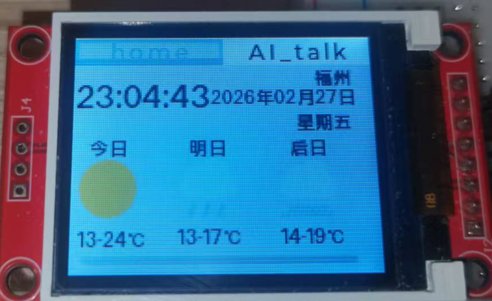
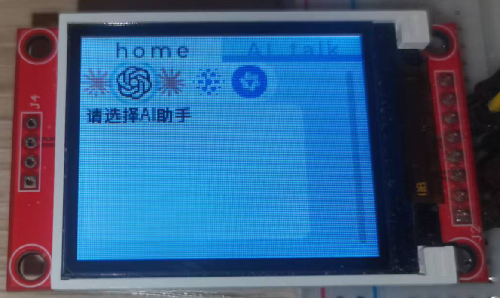
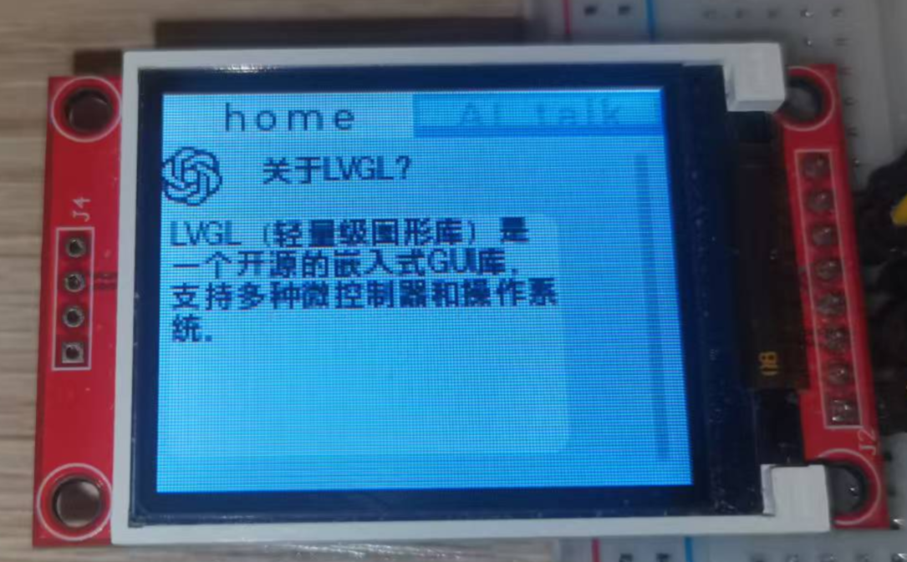
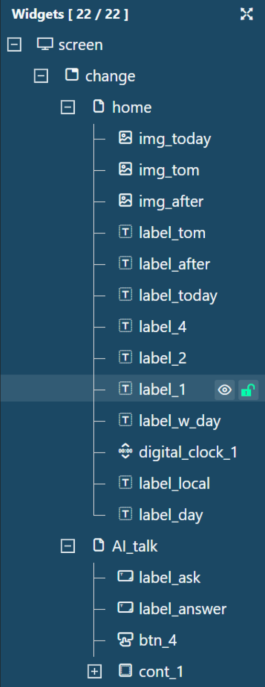
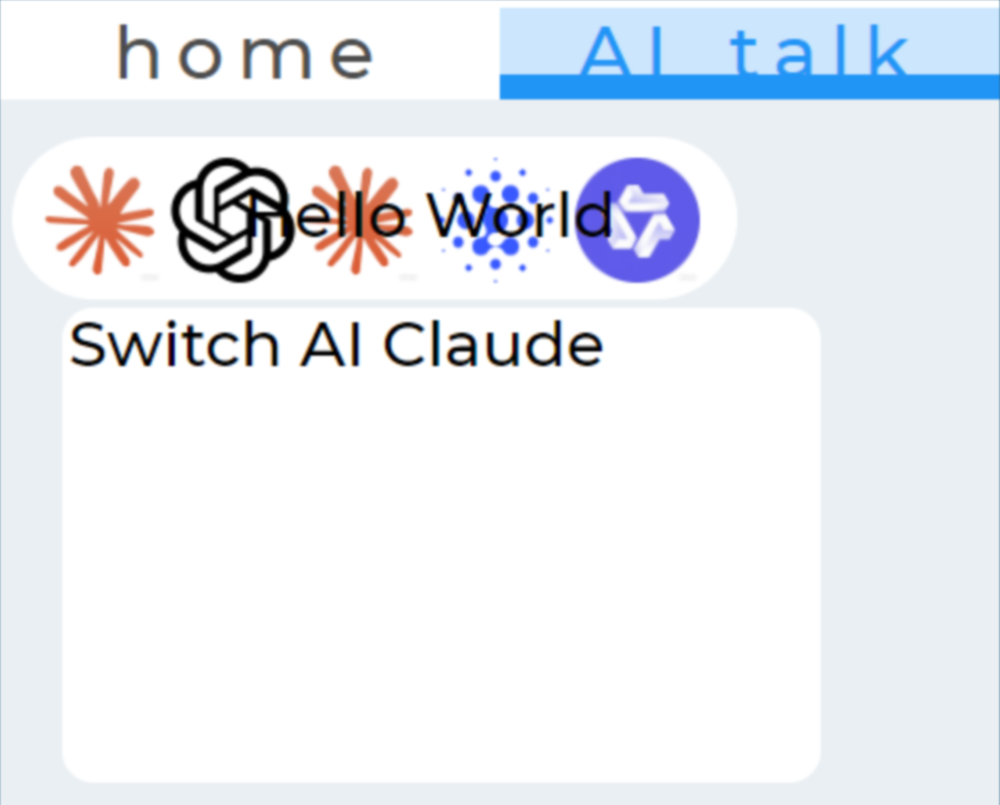
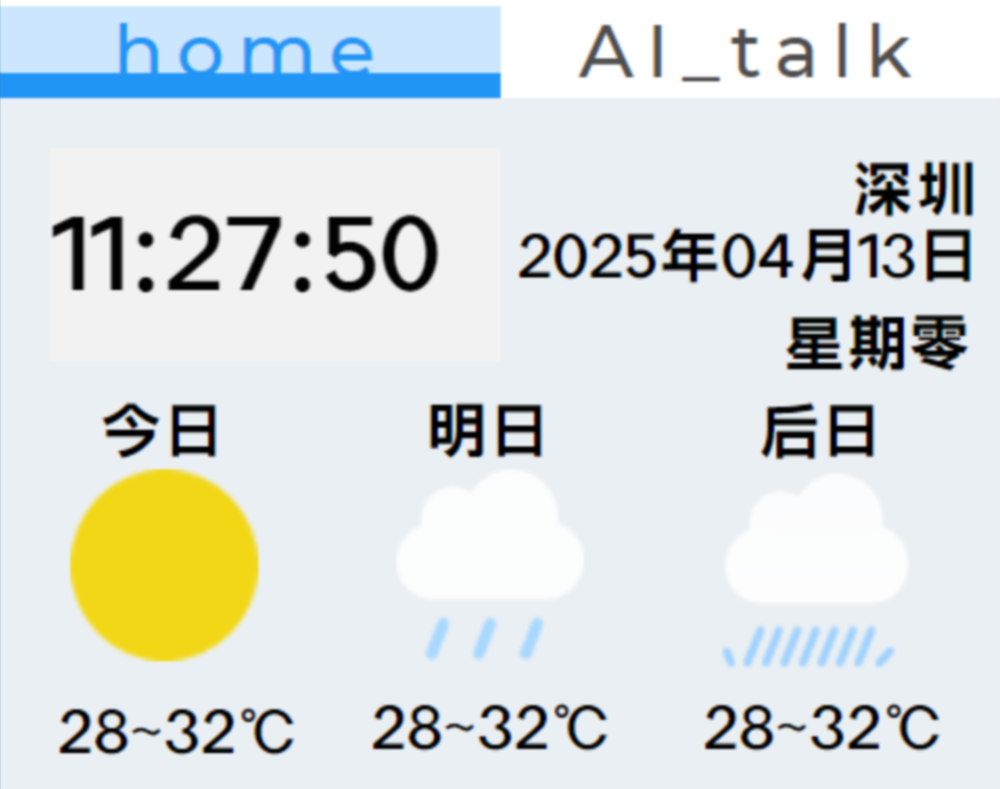

# 🖥️ ESP32 AI Smart Desktop Terminal (端侧 AI 智能桌面终端)


基于 ESP32 平台与 LVGL 图形库开发的一款集成了多款大语言模型（Claude / ChatGPT / GLM /
Qwen）流式对话、天气地理信息获取、智能无线配网于一体的带屏桌面终端设备。

本项目采用前后端分离的设计思想，基于 FreeRTOS 实现了高稳定性的多任务并发调度，并针对 MCU 软渲染长文本容易卡顿的问题进行了底层算法优化。

---

## 🎬 效果演示 (Demo)

> **💡 提示：** 点击下方链接观看完整的实物运行演示视频！
>
> 📺 **[【Bilibili】项目完整运行演示视频展示](这里替换为你的B站或视频链接)**

### 📸 核心功能截图 

<!-- 建议在这里放 2-3 张动图(GIF)或高清照片，展示 UI 动画和打字机效果 -->
<div align="center">




</div>

---
### 📸 GUI-Guider设计的界面原型设计图
<div align="center">




</div>

---

## ✨ 核心特性 (Features)

* 🧠 **多模态大模型接入与流式交互**
    * 基于 HTTP 长连接对接 Claude / ChatGPT / GLM / Qwen 等大模型接口。
    * 独立编写 C 代码解析 Server-Sent Events (SSE) 协议与流式 JSON。
    * **核心优化**：设计“字数/换行”双条件字符缓冲区，将原本百赫兹级的高频单字推流降维至 **5Hz 块刷新**，彻底解决 MCU
      软渲染长文本时的卡顿与死机问题。
* 🎨 **流畅的 LVGL 交互与动效**
    * 使用 GUI Guider 进行界面原型设计，深度定制 LVGL 图形库。
    * 运用 `lv_anim_t` 实现自定义大模型切换的“抽屉式”动画。
    * 通过管理 LVGL Input Group，精确控制硬件按键的焦点游走与事件触发。
* 🌐 **Web Server 无线配网 (SoftAP)**
    * 在内部 SPIFFS 文件系统挂载 HTML 配置页面，摆脱传统局域网限制。
    * 利用 WebSocket 实现前后端双向异步通信（下发 Wi-Fi 列表与接收账号密码）。
    * 结合 FreeRTOS 事件标志组 (EventGroup) 跨任务唤醒 Wi-Fi 连接与 SNTP 授时同步。
* ⚙️ **系统架构与多任务解耦**
    * 将 HTTP 天气/IP定位请求、按键防抖封装为独立的 FreeRTOS Task。
    * 通过**回调函数指针 (Callback) + LVGL 互斥锁 (`lvgl_port_lock`)** 安全触发前端 UI 渲染，实现业务逻辑与底层图形界面的彻底解耦。
    * 规范管控 `cJSON` 与动态内存（`malloc/free`），杜绝多任务并发下的内存泄漏。

---

## 🛠️ 硬件依赖 (Hardware)

* **主控芯片**: ESP32 (WROOM-32 或其他 ESP32 模组)
* **显示屏**: SPI 接口 TFT LCD 屏幕 (1.8寸ST7735)
* **外设**: 独立按键 (用于 UI 焦点切换与交互)

---

## 💻 软件架构与依赖 (Tech Stack)

* **开发环境**: CLion / VS Code + ESP-IDF (v5.3.3)
* **操作系统**: FreeRTOS
* **图形库**: LVGL 9.x
* **其他组件**: cJSON, ESP_HTTP_Client, ESP_WebSocket_Server, SPIFFS

### 📁 核心目录结构

```text
├── components/          # 核心业务组件
│   ├── ai_chat/         # LLM 流式对话与 SSE 解析引擎
│   ├── ap_wifi/         # SoftAP + Web Server 配网逻辑
│   ├── app_control/     # 按键控制与 LVGL 焦点调度
│   ├── fonts/           # 适配ST7735的LVGL字体文件
│   ├── lv_port/         # LVGL 移植接口
│   ├── lvgl/            # LVGL 源码
│   ├── my_button/       # 自定义按键组件，封装事件与状态管理
│   ├── my_sntp/         # SNTP 时间同步任务
│   ├── ST7735/          # ST7735 驱动与接口封装
│   ├── ui/              # GUI Guider 生成的 UI 代码与自定义动效
│   └── weather/         # IP 定位与天气 API 获取
├── main/
│   ├── main.c           # FreeRTOS 任务初始化与入口
│   └── CMakeLists.txt   
├── spiffs/              # SPIFFS 文件系统镜像目录
│   ├── apcfg.html       # 无线配网前端页面
│   └── img/             # UI 图标资源
├── _static/             # README 中使用的图片资源
│   ├── ......           
└── sdkconfig            # ESP-IDF 配置文件